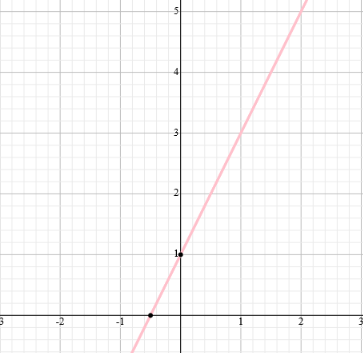

# maths-and-python
Some fun with maths and Python!

## find-the-linear-function

```python
X, Y = [1, 3], [2, 5]

finder = equationFinder(X, Y) 
linear_equation = finder.find_equation()

print(linear_equation)
```
Output:
```
Equation: 2x + 1
```
## find-distance
Find the distance between two points in a coordinate system.
```python
start, end = [0, 0], [5, 5]
distance = find_distance(start, end, round_output=True)

print(distance)
```
Output:
```
7.041
```
